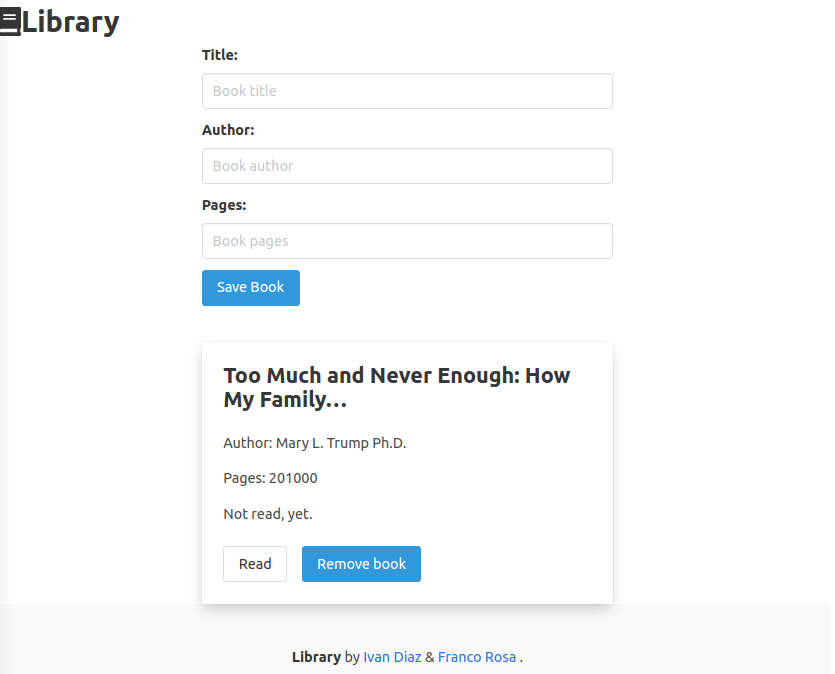

* # library-js

  >  This is part of The Odin Project’sJavaScript Curriculum. Find it at [The Odin Project](https://www.theodinproject.com/courses/javascript/lessons/library)

   
  ## Liveview
  - [Netlify](https://library-js.netlify.app) 
  
  ## Built With
  - JavaScript (ES6)
  - [Bulma](https://bulma.io/) 

  ## Authors

  👤 **Ivan Diaz**

  - Github: [@ivanid22](https://github.com/ivanid22)
  - Twitter: [@ivanid22](https://twitter.com/ivanid22)
  - Linkedin: [Ivan Diaz](www.linkedin.com/in/ivanid22)

  👤 **Franco Rosa**

  - Github: [@Franco Rosa](https://github.com/FrancoRosa)
  - Linkedin: [Franco Rosa](https://www.linkedin.com/in/francoro/)

  ## 🤝 Contributing

   - Contributions, issues and feature requests are welcome!

   - Feel free to check the [issues page](https://github.com/elmejdki/TubeClone/issues).

  ## Show your support

   - Give a ⭐️ if you like this project!

  ## Acknowledgments

   - A big hat to me and my partner Ivan and anyone who help us either by openning issues on this repository or reviewing our code.

  ## 📝 License

  This project is [MIT](lic.url) licensed.
